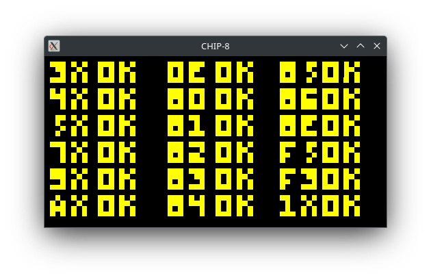
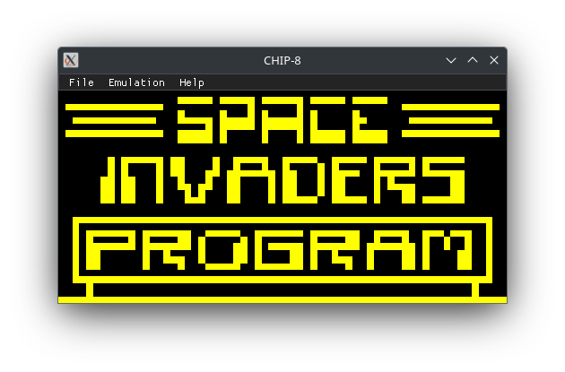
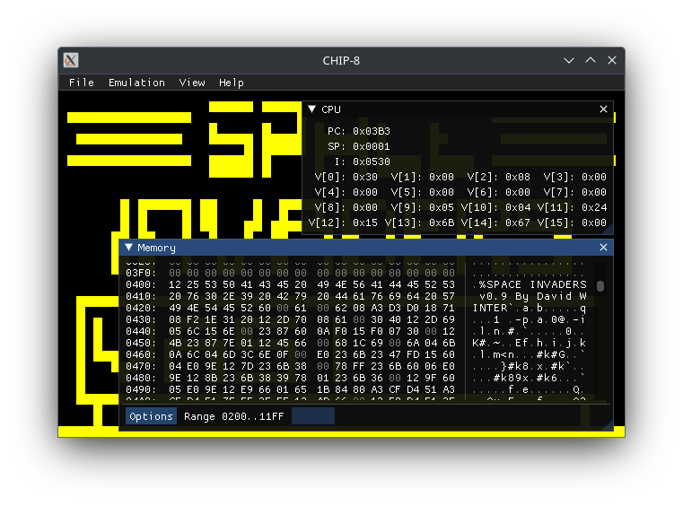

# CHIP-8

CHIP-8 emulator written in C++ for the purpose of learning about emulation.





## Linux

Install requirements:
```bash
sudo apt install build-essential cmake ninja-build libsdl2-dev
```

Compile:
```bash
cd chip-8
mkdir build
cd build
cmake -GNinja ..
ninja
```

Run:
```bash
./chip8 rom_file
```

## Windows

### Visual Studio
Download [SDL2-devel-2.26.3-VC.zip](https://github.com/libsdl-org/SDL/releases/download/release-2.26.3/SDL2-devel-2.26.3-VC.zip) and extract it to **thirdparty** folder.

Open **chip-8** folder in **Visual Studio**

### MSYS2
Install [MSYS2](https://www.msys2.org/) follow instructions on **MSYS2** site.

Open **MSYS2** console and install MinGW, cmake and SDL2
```bash
pacman -S mingw-w64-x86_64-toolchain cmake mingw64/mingw-w64-x86_64-SDL2
```

Compile:
```bash
cd chip-8
mkdir build
cd build
cmake ..
mingw32-make
```

Run:
```bash
./chip8 rom_file
```

## References
[CHIP-8 Wikipedia](http://en.wikipedia.org/wiki/CHIP-8)
